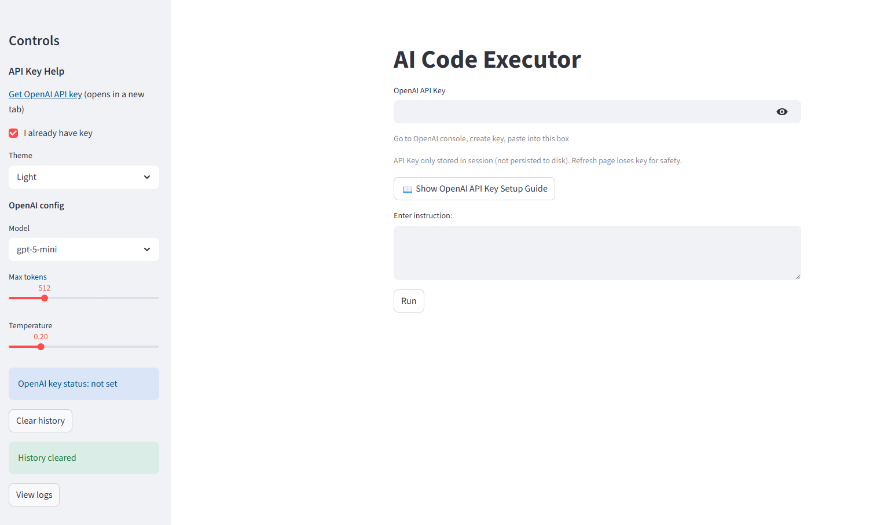
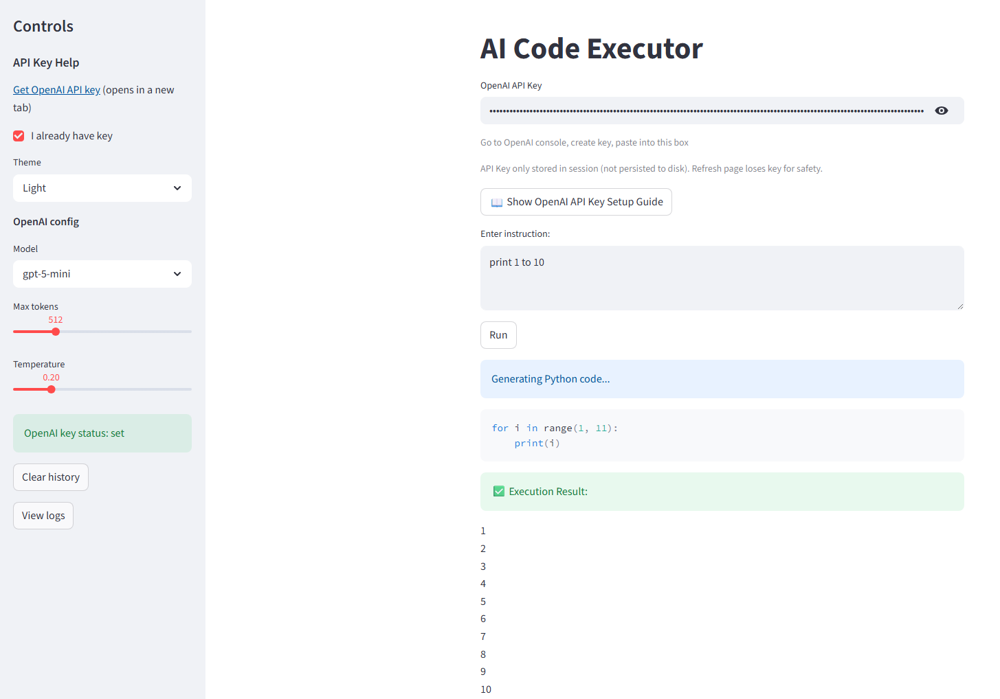
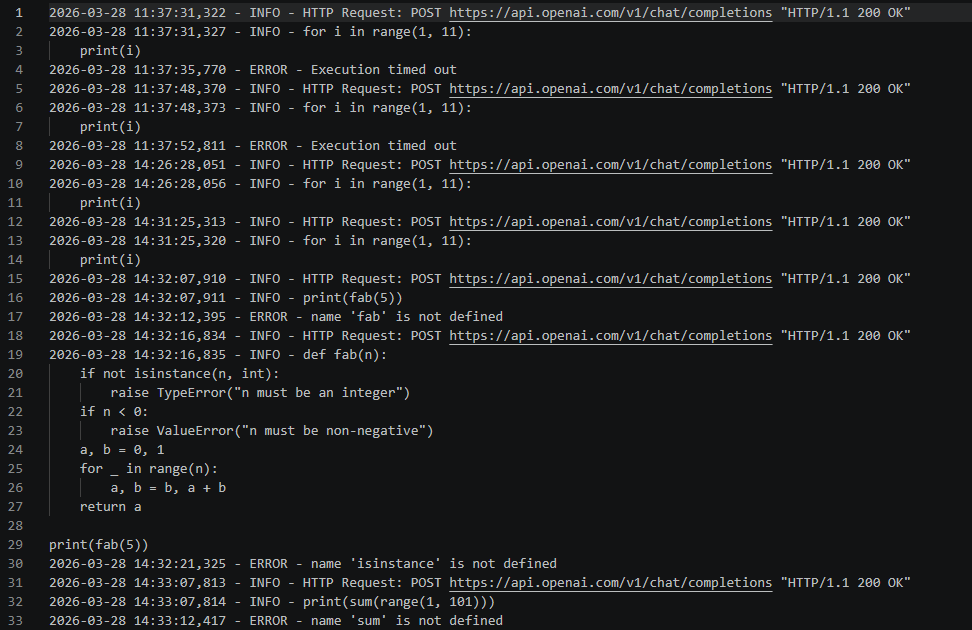

# AI Python Sandbox 🔐

🚀 **Live Demo:** [https://ai-python-sandbox.streamlit.app](https://ai-python-sandbox.streamlit.app)  
💻 **Code on GitHub:** [https://github.com/sundysd/ai-python-sandbox](https://github.com/sundysd/ai-python-sandbox)

A Streamlit project showcasing Python AI experiments, including interactive examples and auto-debug features.

A secure, AI-powered Python code execution environment designed for safe experimentation, learning, and prototyping. Built with AST-based validation, sandboxed execution, and intelligent debugging capabilities.

[](https://www.python.org/)
[](https://opensource.org/licenses/MIT)

## ✨ Features

- **Secure Execution**: AST-based code validation prevents dangerous operations (imports, file access, system calls)
- **AI-Powered Code Generation**: Convert natural language instructions to Python code using OpenAI GPT
- **Auto-Debugging**: Automatically fix and retry failed code executions
- **Session Memory**: Persistent history of user interactions and results
- **Logging System**: Comprehensive execution logs for traceability
- **Web Interface**: Streamlit-based UI for interactive code generation and execution
- **Extensible Architecture**: Modular design for easy customization and expansion

## � Screenshots

### Main Interface


*The Streamlit web interface showing the input field for natural language instructions and execution results.*

### Code Generation Example


*Example of converting natural language to Python code with execution output.*

### History and Logs


*View of session history and execution logs for traceability.*

*Note: Screenshots will be added once the application is running. To add your own screenshots:*
1. Run `streamlit run app.py`
2. Take screenshots of the interface
3. Save them in `screenshots/` directory
4. Update the image paths in this README

## �🚀 Quick Start

### Prerequisites

- Python 3.8+
- OpenAI API key
> Note: The repository does not include your OpenAI key. You can provide it in `.env` or directly in the Streamlit UI input box (recommended for shareable demos).
### Installation

1. **Clone the repository**:
   ```bash
   git clone https://github.com/yourusername/ai-python-sandbox.git
   cd ai-python-sandbox
   ```

2. **Create virtual environment**:
   ```bash
   python -m venv .venv
   source .venv/bin/activate  # On Windows: .venv\Scripts\activate
   ```

3. **Install dependencies**:
   ```bash
   pip install -r requirements.txt
   ```

4. **Set up environment variables**:
   Create a `.env` file in the project root:
   ```
   OPENAI_API_KEY=your_openai_api_key_here
   ```

### Usage

### Get OpenAI API Key
1. Visit `https://platform.openai.com/account/api-keys`
2. Sign up / log in to your OpenAI account
3. Click `Create new secret key`
4. Copy the key (shown only once - save it immediately!)
5. Paste to the Streamlit UI input box (or optionally in `.env`)

Official Guide: https://platform.openai.com/docs/guides/getting-started

#### Quick Run (Recommended)

```bash
cd ai-python-sandbox
pip install -r requirements.txt

# Launch Streamlit
streamlit run app.py
```

Open your browser to `http://localhost:8501` and start using the app!

**Usage:**
- Click sidebar link to get your OpenAI API Key
- Enter your key in the input box
- Type an instruction and click Run
- View history and logs in the sidebar

#### Notes

- `data/history.json` stores recent interaction records (viewable and clearable via UI)
- `data/logs.txt` stores execution/error logs
- Never commit `OPENAI_API_KEY` to repository
- API Key stored only in session (not persisted to disk), refresh page loses key for security

#### Command Line

For CLI usage:
```bash
python app.py --prompt "print hello world"
```

#### Code Examples

**Basic Execution**:
```python
# Input: "calculate the sum of numbers from 1 to 10"
# Generated code executes safely in sandbox
```

**Advanced Features**:
- Automatic error detection and fixing
- History tracking across sessions
- Comprehensive logging

## 📁 Project Structure

```
ai-python-sandbox/
│
├── app.py                  # Main Streamlit web interface
├── executor.py             # Safe code execution engine (AST + sandbox)
├── validator.py            # AST validation rules and security checks
├── debugger.py             # Auto-debugging and error correction
├── generator.py            # AI code generation using OpenAI
├── memory.py               # Session history and data persistence
├── logger.py               # Logging system for execution tracking
│
├── data/
│   ├── history.json        # User interaction history
│   └── logs.txt            # Execution logs
│
├── tests/
│   └── test_executor.py    # Unit tests for execution engine
│
├── requirements.txt        # Python dependencies
├── README.md              # Project documentation
└── .gitignore             # Git ignore rules
```

## 🔧 Configuration

### Environment Variables

- `OPENAI_API_KEY`: Your OpenAI API key (required for code generation)

### Customization

- **Security Rules**: Modify `validator.py` to add/remove allowed operations
- **AI Model**: Change model in `generator.py` (currently uses GPT-4)
- **Logging**: Adjust log levels in `logger.py`

## 🧪 Testing

Run the test suite:
```bash
pytest tests/
```

## 🤝 Contributing

Contributions are welcome! Please:

1. Fork the repository
2. Create a feature branch (`git checkout -b feature/amazing-feature`)
3. Commit your changes (`git commit -m 'Add amazing feature'`)
4. Push to the branch (`git push origin feature/amazing-feature`)
5. Open a Pull Request

### Development Setup

```bash
# Install dev dependencies
pip install -r requirements-dev.txt  # If available

# Run tests before committing
pytest

# Format code
black .
```

## 📄 License

This project is licensed under the MIT License - see the [LICENSE](LICENSE) file for details.

## 🙏 Acknowledgments

- OpenAI for GPT models
- Streamlit for the web framework
- Python AST for secure code execution

## 📞 Support

If you have questions or issues:

- Open an issue on GitHub
- Check the logs in `data/logs.txt` for debugging information

---

**Happy coding safely! 🚀**
